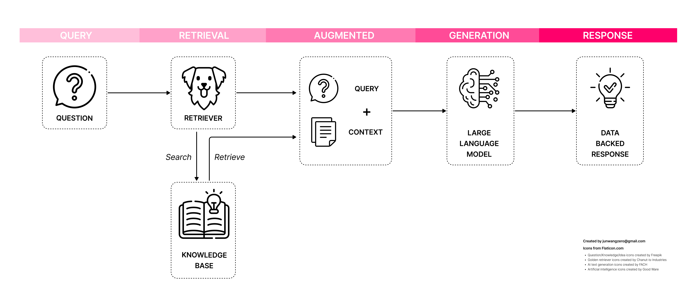
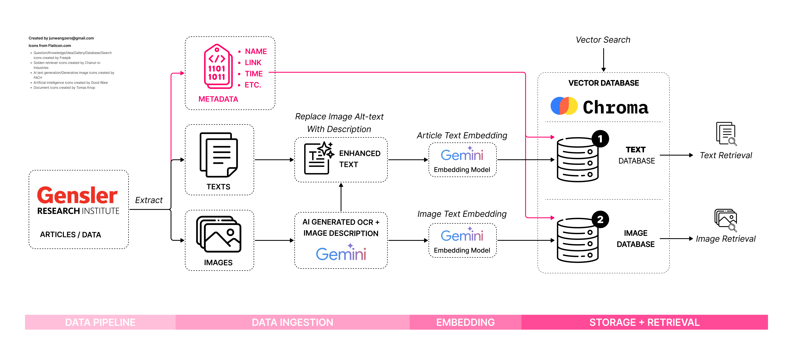

# Project Bridge: A Capstone Project to Address Data Fragmentation in the AEC Industry with AI-Powered Knowledge Retrieval

> [!NOTE] Project Background
>This Capstone Project stems from the 5-day Gen AI Intensive Course with Google (March 31 - April 4, 2025) hosted on Kaggle. It explores applying core Gen AI capabilities taught in the course—like document/image understanding, Retrieval-Augmented Generation (RAG), structured outputs, and function calling—to tackle a real-world challenge in the Architecture, Engineering, and Construction (AEC) industry: creating a **smart information retrieval system**.
> 
> Accompanying this post are a public [Kaggle Notebook](https://www.kaggle.com/code/junwangzero/google-gen-ai-project-capstone-2025-jw-to) detailing the implementation and a [YouTube video](https://www.google.com/url?sa=E&q=link-to-video) discussing the project's background, use cases, and future potential.
> 
> *Acknowledgement: Google's Gemini 2.5 Pro model provided valuable help with drafting and refining this blog post.*

## The Why (Problem Statement)

The Architecture, Engineering, and Construction (AEC) industry, **projected to become a market exceeding $10 trillion by 2030** (_Oxford Economics, 2021_), has consistently ranked among the least technologically innovative industries in the world. As McKinsey noted, AEC businesses often end up with little to show for their technology investments, citing structural barriers such as **the fragmentation of the project value chain, the transient nature of project teams, and chronically low R&D spending** (_McKinsey & Company, 2019_).

While modern AEC workflows generate huge volumes of data—from BIM models and RFIs to job-site photos—**an estimated 96% of this data goes unused** (_FMI Corporation, 2018_), often being hard to sift through in dated, siloed data systems, buried in PDFs, or lost in inboxes. AEC professionals spend, on average, **13% of their time just searching for project information**, with **$88 billion in avoidable rework annually** (_Autodesk & FMI, 2021_).

With this data fragmentation still an ongoing challenge, what if AI could help connect buried insights to the real-time needs of project teams? That question led us to build a proof-of-concept **Retrieval-Augmented Generation (RAG) system**, designed to surface relevant knowledge at the right time, from the right source, with generative context, and tailored for the AEC industry.

## The What (Our Solution)

At its core, this project leverages **Retrieval-Augmented Generation (RAG)**. RAG systems uniquely combine the search power of vector databases with the generative capabilities of **Large Language Models** (LLMs). Instead of relying solely on generic training data, RAG grounds the LLM's responses in specific, relevant content retrieved from your own knowledge base. This dramatically reduces irrelevant or "hallucinated" answers, providing precise, context-aware information.


**Figure 1.** RAG System Overview — How a query becomes a data-backed response.

As shown in **Figure 1**, a user’s natural-language query flows through a retriever, which searches a knowledge base for relevant documents. The retrieved content is passed to a large language model, which then generates a response based on actual data — not generic training data or "hallucination".

For AEC professionals, this opens up new possibilities. Instead of digging through folders or legacy PDFs, teams can now ask questions like _“What are five design strategies for reactivating retail corridors?”_ or _“Show me recent mixed-use projects with plaza-facing residential units,”_ and receive grounded, project-specific responses in seconds.

Recognizing that AEC knowledge is heavily visual, we extended this concept to **multimodal RAG**. Our system can retrieve and understand not just text, but also relevant diagrams, sketches, photos, and their associated context, providing a more holistic knowledge retrieval experience.

## The How (Implementation + Technology)


**Figure 2.** Proof-of-Concept RAG System Tailored for AEC Knowledge.

This proof-of-concept extends a standard RAG pipeline into a **multimodal, metadata-aware, and structured-response system** tailored for the complexities of the AEC industry. As shown in **Figure 2**, the pipeline moves through four primary stages: **data ingestion**, **embedding**, **retrieval**, and **generation** — all orchestrated via autonomous function calling powered by Gemini.

| **Layer**                | **Tools & Technologies**                                                               | **Purpose**                                                                                                                    |
| ------------------------ | -------------------------------------------------------------------------------------- | ------------------------------------------------------------------------------------------------------------------------------ |
| **LLM & Vision Models**  | gemini-2.0-flash: [Gemini (Google AI API)](https://ai.google.dev)                      | Natural language understanding, function calling, generative responses, and vision-based image captioning (OCR + description). |
| **Image Generation**     | gemini-2.0-flash-exp-image-generation: [Gemini (Google AI API)](https://ai.google.dev) | Generates AI-rendered images based on text prompts, captions, or related metadata.                                             |
| **Embedding Models**     | text-embedding-004: <br>[Gemini (Google AI API)](https://ai.google.dev)                | Converts text and image metadata into high-dimensional semantic vectors.                                                       |
| **Vector Database**      | [ChromaDB](https://www.trychroma.com)                                                  | Stores and indexes vectorized content for fast semantic search (dual collection: text & image).                                |
| **Retrieval Layer**      | Custom Retriever + Function Calling                                                    | Intelligently routes queries to the appropriate retrieval or generation tool.                                                  |
| **Data Sources**         | [Gensler Research Library](https://www.gensler.com/research-library)                   | Real-world AEC knowledge base for demonstration.                                                                               |
| **Data Pipeline**        | Python, Pandas, Gemini API                                                             | Extracts, cleans, enriches, and embeds text + image data.                                                                      |
| **Output Formatting**    | JSON → Markdown Renderer                                                               | Ensures structured, readable AI responses with custom citation and layout control.                                             |
| **Notebook Environment** | [Kaggle Notebooks](http://kaggle.com/)                                                 | Interactive development and public demonstration environment.                                                                  |

### 1. Data Ingestion & Enrichment:

The pipeline starts by ingesting content (articles, reports, case studies) from sources like the **Gensler Research Institute**, containing: Text-based content (thought leadership articles, research reports, design insights), Visual content (photos, diagrams, project case studies), and  Metadata (title, source links, etc.).


**Figure 3.** Example article/image/metadata being processed.

For images, **Gemini Vision** models generate rich descriptions (incorporating alt-text, captions, OCR, and visual details), which are stored alongside source URLs and unique IDs.


**Figure 4.** Running a sample image through AI processing function and return its AI-generated description below.

And below is part of the image parsing logic, the function `describe_image_from_url`. It downloads an image from a URL, sends it to a Gemini multimodal model, and uses prompt to ask for a rich, multi-layered visual description.

```python
# set up a function that returns the description of an image from a given url
def describe_image_from_url(image_url, client, model_name="gemini-2.0-flash"):
    """
    Downloads an image from a URL, sends it to Gemini for description,
    and returns a one-sentence description string.
    """
    # Extract filename from URL
    filename = image_url.split("/")[-1]
    
    # Download image
    response = requests.get(image_url, stream=True)
    if response.status_code != 200:
        return f"[Could not retrieve image: {image_url}]"
    
    with open(filename, "wb") as f:
        f.write(response.content)

    # Open image
    image = PIL.Image.open(filename)

    # Prepare prompt
    prompt = [
        """Describe this image in as much detail as possible, 
        including all visible objects, text (perform OCR), 
        spatial relationships, colors, context clues, 
        and any other relevant visual information. 
        Be sure to also include information such as:
        types of image: whether it's a photo, rendering, 
        data visualization graphics, etc.;
        if it's a data visualization or contains data, 
        please really recognize all numbers, text, 
        data from the image and translate into complete sentences;
        types of view (can be multiple): aerial, eye level, 
        building exterior, building interior;
        types of design descipline (can be multiple): 
        architecture, interior, urban planning/design, branding, 
        digital experience, etc.;
        times of day and generate lighting condition: day, night, 
        bright, dark, etc.;
        types of design style: modern, industrial, minimalist, 
        mid-century modern, soft, welcoming, energetic, etc.;
        general material and color palette summary: 
        is it warm? does it have wood, textile, stone, etc.;
        Only provide 1 to 5 comprehensive sentences.""",
        image,
    ]

    # Get description from Gemini
    gemini_response = client.models.generate_content(
        model=model_name,
        contents=prompt
    )
    
    # Clean up file
    os.remove(filename)

    return gemini_response.text.strip()
```

### **2. Semantic Embedding & Dual Vector Storage**


**Figure 5.** Flow diagram of the data ingestion and embedding workflow.

As shown in Figure 5, using **Gemini Embedding Models**, processed text and enriched image descriptions are converted into vectors and stored in two separate **ChromaDB** collections (one for text, one for images).

Here is the definition of the Embedding Function below:

```python
from chromadb import Documents, EmbeddingFunction, Embeddings

class GeminiEmbeddingFunction(EmbeddingFunction):
    # Specify whether to generate embeddings for documents, or queries
    document_mode = True
    # Specify embedding model
    embedding_model = "models/text-embedding-004"

    @retry.Retry(predicate=is_retriable)
    def __call__(self, input: Documents) -> Embeddings:
        if self.document_mode:
            embedding_task = "retrieval_document"
        else:
            embedding_task = "retrieval_query"

        response = client.models.embed_content(
            model=self.embedding_model,
            contents=input,
            config=types.EmbedContentConfig(
                task_type=embedding_task,
            ),
        )
        return [e.values for e in response.embeddings]
```

This allows targeted retrieval of text, visuals, or both, mirroring the hybrid nature of AEC information needs.

Below are code snippets populating the two vector databases for texts as well as images (the image database code is a little lengthier to bypass the free API key's batch limit).

```python
import chromadb

DB_NAME = "genslerthoughtdb"

embed_fn = GeminiEmbeddingFunction()
embed_fn.document_mode = True

chroma_client = chromadb.Client()
db = chroma_client.get_or_create_collection(name=DB_NAME, embedding_function=embed_fn)

# Delete by ID before re-adding
db.delete(ids=[str(i) for i in range(len(parsed_docs))])

db.add(
    documents=parsed_docs,
    metadatas=metadatas,
    ids=[str(i) for i in range(len(parsed_docs))]
)
```

```python
# Create image embedding index from parsed_docs
image_embed_fn = GeminiEmbeddingFunction()
image_embed_fn.document_mode = True

image_db = chroma_client.get_or_create_collection(name="gensler_image_index", embedding_function=image_embed_fn)

image_docs = []
image_ids = []
flat_image_metadatas = []

for i, doc_img_datas in enumerate(image_metadatas):
    for j, img_data in enumerate(doc_img_datas):
        # Create embedding text 
        # (can be description or caption + description)
        caption = img_data.get("caption", "").strip()
        description = img_data.get("generated_description", "").strip()
        
        # Combine caption and description
        text_to_embed = f"{caption} — {description}" if caption else description
        if not text_to_embed:
            print(f"⚠️ Skipped image in doc {i}, index {j}")
            print("  Caption:", repr(caption))
            print("  Description:", repr(description))
            print("  Image URL:", img_data.get("image_url", "N/A"))
            continue  # skip if nothing to embed
            
        image_docs.append(text_to_embed)
        # Keep metadata and ID
        image_ids.append(f"{i}_{j}")  # document i, image j
        img_data["doc_id"] = i  # enrich metadata with doc ID
        img_data["title"] = metadatas[i].get("title", "Untitled")
        img_data["source"] = metadatas[i].get("source", "#")
        flat_image_metadatas.append(img_data)

# Clear existing entries (optional)
image_db.delete(ids=image_ids)

# batching utility funciton
# as we can only have 100 requests max in a single batch to Google AI API
batch_size = 100
def chunked(iterable, size):
    for i in range(0, len(iterable), size):
        yield iterable[i:i + size]

if image_docs and flat_image_metadatas and image_ids:
    for doc_batch, meta_batch, id_batch in zip(
        chunked(image_docs, batch_size),
        chunked(flat_image_metadatas, batch_size),
        chunked(image_ids, batch_size)
    ):
        image_db.add(
            documents=doc_batch,
            metadatas=meta_batch,
            ids=id_batch
        )
        print(f"✅ Indexed {len(doc_batch)} images.")
else:
    print("No images were found to index.")
```

### **3. Function Calling & Semantic Retrieval**

When a user submits a query (e.g., _“Show me recent projects with public plaza interfaces”_), it is first handled by **Gemini via Google AI API**, which uses **autonomous function calling** to decide the best action: query the text DB, the image DB, generate a new image, synthesize an answer, or write a new article.

Code below sets up the function calling configuration, with specific functions (tools) are defined elsewhere in the notebook.

```python
tools = [
    tool_articles_search_results,
    tool_image_search_results,
    answer_with_sources,
    tool_generate_article_with_images,
    tool_image_generate,
]
# meta variables to be included in the system instruction prompt
top_k = 5
max_distance_far = 0.99
max_distance_mid = 0.85

instruction = f"""
you're a helpful assitant that can interact with databases
set up in ChromaDB. You will take the user's questions and turn them into queries using the tools available. 
Once you have the information you need, you must use its return value directly in your response without paraphrasing or summarizing it. 
This is very very important.
Always show the full content from the tool result so the user sees the images and article links.

Use {tools[0]} to query articles from the database (When calling the article search tool, 
ALWAYS request at least 5 results using a top_k value of {top_k} and a max_distance of {max_distance_mid} unless the user 
specifies otherwise.). 

Use {tools[1]} to search and display images from the database (When calling the image 
search tool, ALWAYS request at least 5 results using a top_k value of {top_k} and a max_distance of {max_distance_far}
unless the user specifies otherwise.). 

When a user asks for an explanation, summary, analysis, or strategic insight, call the summarize_with_sources tool
(When calling the {tools[2]}, ALWAYS request at least 5 results using a top_k value of {top_k} and a max_distance of {max_distance_mid} 
unless the user specifies otherwise.).This tool will search the article database, retrieve relevant documents, and generate a 
structured answer in the style of bullet points with citations. 
Return the tool output directly without summarizing or rephrasing it.

When the user asks for a new article to be written, use the {tools[3]} tool to generate a thought leadership
article for the AEC industry. (When calling the generate_article_with_images, 
ALWAYS use a top_k value of {top_k} unless the user specifies otherwise.)
This {tools[3]} tool will retrieve relevant articles from a proprietary database as few-shot examples,
Generate a new article using those examples, and Automatically insert well-placed visuals with captions and descriptions. 
Use the tool’s output directly in your response. Do not rewrite, paraphrase, or summarize it. 
If visuals are included, render them inline with their descriptions and captions.
Only use this tool for full article generation requests, not for quick answers or summaries.

When the user requests a new image, call {tools[4]} with their caption and description, do not add any additional text. 
Return only the tool's response, exactly as it was returned, without framing such as "Here is..." or "According to the results...".
Use the output directly in your reply.
"""

chat = client.chats.create(
    model="gemini-2.0-flash",
    config=types.GenerateContentConfig(
        system_instruction=instruction,
        tools=tools,
        tool_config=types.ToolConfig(
            function_calling_config={"mode": "auto"}
        )
    ),
)
```

It then calls the appropriate tool (e.g., our custom ChromaDB search functions) as needed by the user's request.


**Figure 6.** AI recognizes a natural language request for image search and responded correctly via function calling in the background.


> [!info] Few-Shot Prompting
> Few-shot examples are examples that you include in a prompt to show the model what getting it right looks like. Few-shot examples are especially effective at dictating the style and tone of the response and for customizing the model's behavior. 
> [Introduction to prompting  \|  Generative AI on Vertex AI  \|  Google Cloud](https://cloud.google.com/vertex-ai/generative-ai/docs/learn/prompts/introduction-prompt-design#few_shot_examples)

Below is one such callable function that generate a new article via **Few-Shot Prompting** using retrieved article based on query as examples:

```python
# RAG generation - Article generation, wrapper function containing modularized functions defined above
def tool_generate_article_with_images(gen_query: str, top_k: int) -> str:
    """
    Generates a thought leadership article using few-shot prompting, 
    and inserts images.
    Returns a complete Markdown-formatted article.
    """
    # Step 1: Build few-shot prompt
    gen_rag_prompt = build_few_shot_prompt(gen_sys_prompt, gen_query, gen_output_format, top_k=top_k)

    # Step 2: Generate article content
    response = client.models.generate_content(
        model="gemini-2.0-flash",
        contents=[gen_rag_prompt]
    )
    raw_article = response.text.strip()

    # Step 3: Replace placeholders with image markdown
    updated_article = replace_generate_image_markdown(raw_article)

    # Step 4: Display and return result
    display(Markdown("---"))
    display(Markdown(updated_article))

    return updated_article    

```

### **4. Structured Generation & Controlled Output**  

The retrieved data is passed to the LLM for generation — but instead of returning freeform text, the system produces a **structured JSON output**.

Here is one example of a callable function that performs retrieval and generates structured JSON output, which **is** then cleanly formatted to include citations:

```python
# RAG generation - Article Summarization
class AnswerWithCitations(TypedDict):
    answer: str
    citations: List[int]

def answer_with_sources(query: str, top_k: int, max_distance: float) -> str:
    """
    Perform a RAG query and structured summarization of database articles.
    Returns markdown-formatted answer with footnotes.
    """
    # Step 1: Retrieve filtered results
    result = search_chroma(query, top_k=top_k)
    keep_indices = [i for i, d in enumerate(result["distances"][0]) if d <= max_distance]

    # Step 2: Build prompt with selected articles
    filtered_result = {k: [[v[0][i] for i in keep_indices]] if isinstance(v, list) and len(v) > 0 and isinstance(v[0], list) else v for k, v in result.items()}
    rag_prompt, structured_articles = build_rag_prompt(system_prompt, query, output_format, result=filtered_result)

    # Step 3: Define schema + config for structured return
    structured_config = types.GenerateContentConfig(
        response_mime_type="application/json",
        response_schema=AnswerWithCitations,
        temperature=0.1
    )

    # Step 4: Run Gemini generation
    response = client.models.generate_content(
        model="gemini-2.0-flash",
        config=structured_config,
        contents=[rag_prompt]
    )

    structured = response.parsed
    used_ids = set(structured["citations"])

    # Step 5: Format footnotes
    footnotes = "\n".join(
        f"[{a['ref_id']}]: [{a['title']}]({a['url']}) | Relevance: {(1 - a['distance']) * 100:.1f}%  "
        for a in structured_articles if a["ref_id"] in used_ids
    )

    final_output = f"{structured['answer']}\n\n---\n**References**\n\n{footnotes}"
    display(Markdown(final_output))
```

This is then rendered into user-friendly Markdown format, enabling consistent formatting, accurate citations (linking back to original sources), and reliable extraction of information for downstream use.


**Figure 7.** AI recognizes a natural language request for general question and responded with retrieved data in a structured way with citations.

Depending on the request, the output could be a natural language answer, retrieved images, a newly generated image, or even a full article drafted based on existing examples, which enables a more natural and human-like conversation user experience.

## The Use Cases

A fully developed system like this could fundamentally change how AEC professionals access and leverage collective knowledge:

- **Instant Answers for Meetings & Reviews:** Quickly retrieve precedents, design details, or research findings during client meetings or internal reviews (e.g., "Show examples of sustainable facade details used in our recent high-rise projects").
- **Data-Driven Planning:** Access past project metrics (e.g., cost per square foot for specific lab types, typical circulation space ratios) to inform early-stage planning and feasibility studies.
- **Accelerated Content Creation:** Assist in drafting proposals, reports, or thought leadership by using relevant internal knowledge and past examples as a foundation, ensuring brand consistency and leveraging existing insights.
- **Enhanced Collaboration & Onboarding:** Enable team members, especially junior staff or those new to a project type, to independently explore the firm's expertise and design standards, fostering faster learning and reducing reliance on specific individuals.

Ultimately, the goal is to break down knowledge silos and make the firm's collective intelligence readily accessible, improving efficiency, consistency, and innovation.

## Acknowledgement and Opportunities

This proof-of-concept highlights the potential. **Several areas, limited by the scope** of this initial phase and the preliminary technology used, **offer avenues for future development**:

- **Scalable Data Ingestion:** The current pipeline relies on relatively clean blog data. A production system needs robust ingestion for diverse formats (PDFs, CAD files, scanned documents, emails) from various repositories.
- **Advanced Chunking & Embedding:** while avoided so far thanks to Gemini’s long context, strategic document chunking will be vital for large datasets. Exploring specialized embedding models (e.g., for diagrams, tables, or code) could also improve retrieval precision.
- **Sophisticated Retrieval:** Implementing techniques like weighted ranking, or metadata filtering during search, could enhance search relevance.
- **Live Data Integration:** Connecting to live project databases or operational systems via APIs would provide real-time context, moving beyond static knowledge bases.

## What's Next

This project represents an early proof of concept. In future iterations, I plan to explore several directions to make this system more powerful, practical, and production-ready:

### Data, Models & Retrieval

- Introduce **ranking and weighting mechanisms** to improve relevance in search as data and project examples can be weighted naturally in practice;
- Expand the pipeline to ingest PDFs, BIM model summaries, intranet wikis, and internal specifications to really address how use cases arise in a real world setting;
- Adopt **more specialized embedding models** for long documents, structured data, and native image encoding, for example something like `Doc2Vec` that would be able to capture, in addition to individual words, document context, order, and overall structure of the document;
- Explore **multi-modal fusion retrieval**, where image and text results are merged to create a more complete answer.

### Intelligence & Interface

- Integrate **chunking strategies** to improve retrieval performance while still taking advantage of Gemini’s long context capabilities (up to 1 million tokens)
- Experiment with **agentic workflows**, where the system can interact with users in a natural back-and-forth conversation and reason across multiple steps or query iterations
- Provide **live access to internal databases** via secure API calls, enabling up-to-date project knowledge

### UX & Deployment

- Develop a **custom web/app interface** tailored for AEC workflows, with interactive previews, faceted filtering, and visual-first outputs
- Improve structured output control, especially for **citations, media formatting, and design-focused layouts**

This project demonstrates that Gen-AI, particularly through RAG and multimodal understanding, offers a powerful pathway to address the long-standing challenge of data fragmentation in the AEC industry, unlocking valuable knowledge to drive better design, planning, and construction outcomes. While challenges remain, this proof-of-concept demonstrates Gen AI's potential to transform knowledge work in AEC. By bridging data silos and making expertise accessible, systems like this can empower professionals to design and build more effectively.

---
## References

Autodesk & FMI. (2021). Harnessing the data advantage in construction. https://construction.autodesk.com/resources/guides/harnessing-data-advantage-in-construction/

FMI Corporation. (2018). Big data = big questions: Harnessing data-driven insights in construction. https://fmicorp.com/uploads/media/FMI_BigDataReport.pdf

McKinsey & Company. (2019). Decoding digital transformation in construction. https://www.mckinsey.com/industries/engineering-construction-and-building-materials/our-insights/decoding-digital-transformation-in-construction

Oxford Economics. (2021). Future of construction: A global forecast for construction to 2030. https://www.oxfordeconomics.com/wp-content/uploads/2023/08/Future-of-Construction-Full-Report.pdf