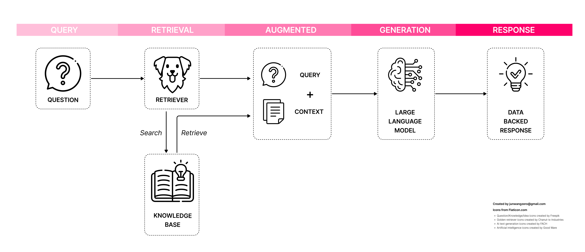
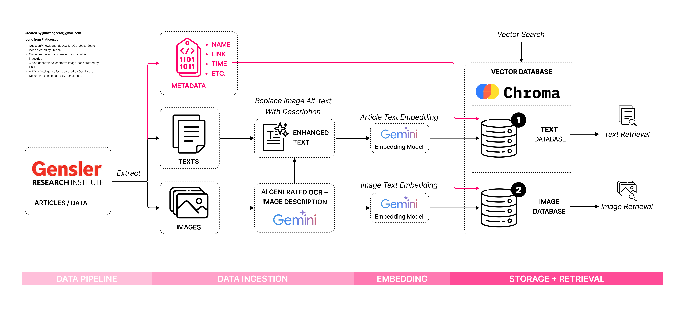

# Project Bridge: Bridging the Gap in Data Fragmentation for AEC with AI-Powered Knowledge Retrieval

> **Project Background**
> 
> This capstone project stems from the 5-day **Google Gen AI Intensive Course** (March 31 - April 4, 2025) hosted on Kaggle. It explores applying Gen AI capabilities — including document/image understanding, Retrieval-Augmented Generation (RAG), structured outputs, and function calling — to address a real-world challenge in the Architecture, Engineering, and Construction (AEC) industry: creating a **smart information retrieval system**.
>
> 🔗 [Public Kaggle Notebook (Phase 1)](https://www.kaggle.com/code/junwangzero/google-gen-ai-project-capstone-2025-jw-to)  
> 🔗 [GitHub Repo](https://github.com/warm-july/Project-Bridge-AEC-RAG)  
> 🎥 [YouTube Project Overview](https://www.youtube.com/watch?v=iwlgeVLrNbU)
>
> _Acknowledgement: Google's Gemini 2.5 Pro model provided valuable assistance in drafting and refining this work._

---

## 🎥 Video Summary

  <iframe src="https://www.youtube.com/embed/iwlgeVLrNbU" 
          frameborder="0" 
          allowfullscreen 
          style="position: absolute; top: 0; left: 0; width: 100%; height: 100%;">
  </iframe>

---

## Why: The Problem Statement

The AEC industry, projected to surpass **$10 trillion by 2030** (Oxford Economics, 2021), remains one of the least digitized sectors. Key challenges include:

- Highly **fragmented project value chains**
- **Transient project teams**
- **Chronically low R&D spending** (McKinsey, 2019)
- **96% of project data remains unused** (FMI Corporation, 2018)
- Professionals spend **13% of their time searching** for project information, causing **$88 billion** in annual rework losses (Autodesk & FMI, 2021)

Despite generating mountains of data — BIM models, RFIs, photos — much of it gets siloed, buried, or lost.

> _What if AI could surface the right knowledge at the right moment, grounded in real project data, for real-time project needs?_

That led us to build a proof-of-concept: a **multimodal Retrieval-Augmented Generation (RAG) system** tailored for the AEC industry.

---

## What: The Solution

At its core, the solution leverages **RAG**: a combination of semantic search and generative AI.

**Figure 1.** How a query flows through a retrieval-augmented generation system.

Rather than relying solely on pretraining, the LLM dynamically retrieves relevant project-specific content, grounds its responses, and generates targeted answers. Recognizing that AEC knowledge is highly visual, our system supports both text and image retrieval.

Teams can now ask:

- _"What are five design strategies for revitalizing retail corridors?"_
- _"Show me examples of residential buildings with public plazas."_

And receive grounded, visual-rich answers from their internal knowledge base — within seconds.

---

## How: System Overview

**Figure 2.** Multimodal, metadata-aware RAG pipeline tailored for AEC knowledge.

| Layer                    | Tools & Technologies                                               | Purpose                                                              |
| ------------------------ | ----------------------------------------------------------------- | -------------------------------------------------------------------- |
| **LLM & Vision Models**   | Gemini-2.0-Flash (Google AI)                                       | Natural language and image understanding; function calling          |
| **Image Generation**      | Gemini Vision (Google AI)                                          | Generate captions, descriptions, visual context                     |
| **Embedding Models**      | Gemini text-embedding-004                                          | Semantic embedding for text and images                              |
| **Vector Database**       | [ChromaDB](https://www.trychroma.com)                              | Semantic storage for fast retrieval                                 |
| **Data Pipeline**         | Python, Pandas, Gemini API                                         | Data extraction, enrichment, embedding                              |
| **Retrieval Layer**       | Custom Retriever + Autonomous Function Calling                    | Intelligent query routing to retrieval or generation functions      |
| **Output Rendering**      | JSON ➔ Markdown                                                    | Structured responses with citations and layout control              |
| **Environment**           | [Kaggle Notebooks](https://www.kaggle.com/)                        | Public development and demonstration platform                      |

### 1. Data Ingestion & Enrichment

Content was ingested from real-world sources like the [Gensler Research Library](https://www.gensler.com/research-library), including:

- Articles, reports, and case studies
- Diagrams, project photos, and visual collateral
- Metadata (titles, captions, source URLs)

**Figure 3.** Example of structured ingestion and enrichment.

Images underwent AI-powered captioning, OCR, and multi-layered description generation using Gemini Vision models.

**Figure 4.** Rich visual descriptions generated automatically.

### 2. Embedding and Dual Vector Storage

Text and enriched visual data were embedded into semantic vectors using Gemini models and stored into two parallel **ChromaDB** collections.

**Figure 5.** Embedding pipeline for scalable multimodal knowledge bases.

This structure enables either text-first, image-first, or hybrid retrieval depending on the query.

### 3. Autonomous Function Calling and Retrieval

Using Gemini's **function calling**, natural language queries are routed automatically to appropriate actions:

- Querying articles
- Searching images
- Summarizing with sources
- Generating new images or articles

**Figure 6.** Gemini recognizes when to trigger search vs. generation.

### 4. Structured Output and Markdown Rendering

Structured JSON outputs ensure:

- Clear answers with accurate citations
- Consistent visual layout
- Easy extension into custom UIs

**Figure 7.** Natural language answers rendered with citations and references.

---

## Use Cases

If developed fully, systems like this could revolutionize knowledge access in AEC:

- **Instant Precedent Search:** Find detailed examples for design reviews and meetings.
- **Planning Insights:** Access historical cost data, space planning ratios, or zoning precedents.
- **Proposal and Report Drafting:** Accelerate content creation by using existing knowledge foundations.
- **Onboarding and Training:** Help new hires explore standards and best practices independently.

Ultimately, this helps bridge internal silos, surface insights faster, and empower more consistent, innovative project delivery.

---

## What's Next: Future Development

Building on this proof-of-concept, planned extensions include:

- **Advanced Retrieval:**
  - Metadata-filtered and weighted ranking
  - Live access to project management and BIM platforms via APIs
- **Expanded Ingestion:**
  - PDFs, scanned documents, intranet wikis
  - Auto-summarization for CAD/BIM metadata
- **Intelligence Enhancements:**
  - Agentic multi-step workflows
  - Specialized embeddings (e.g., Doc2Vec, visual-tactile fusion)
- **User Experience:**
  - Custom web/app interface with interactive previews
  - Visual-first output layouts and citation tracking

---

## References

- Autodesk & FMI. (2021). [Harnessing the Data Advantage in Construction](https://construction.autodesk.com/resources/guides/harnessing-data-advantage-in-construction/)
- FMI Corporation. (2018). [Big Data = Big Questions](https://fmicorp.com/uploads/media/FMI_BigDataReport.pdf)
- McKinsey & Company. (2019). [Decoding Digital Transformation in Construction](https://www.mckinsey.com/industries/engineering-construction-and-building-materials/our-insights/decoding-digital-transformation-in-construction)
- Oxford Economics. (2021). [Future of Construction: A Global Forecast to 2030](https://www.oxfordeconomics.com/wp-content/uploads/2023/08/Future-of-Construction-Full-Report.pdf)

---

> ✨ _By connecting fragmented insights to real-time needs, AI can help AEC professionals design, plan, and build better._